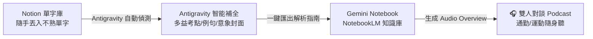
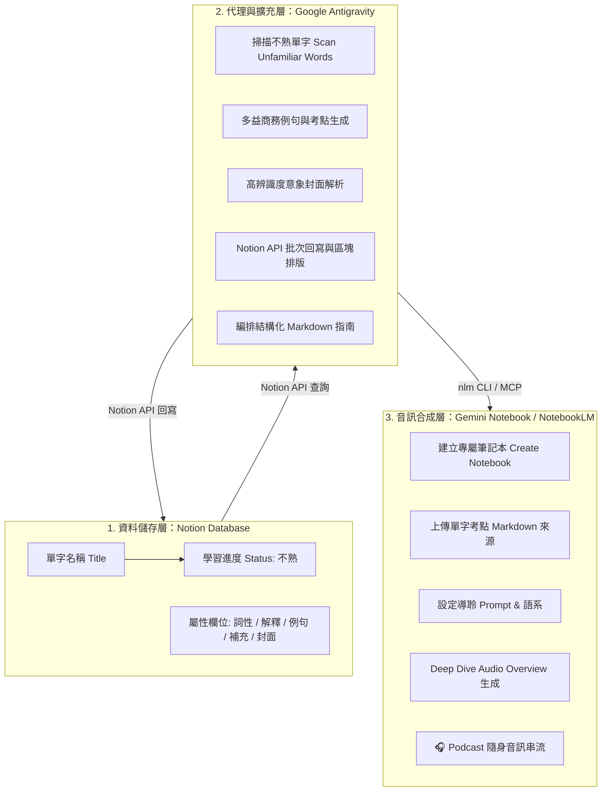

<!-- SIMPLE -->

平常閱讀英文文獻、工作郵件或準備多益（TOEIC）時，遇到生疏的單字，我習慣隨手記進 Notion。但傳統的單字卡有個常見痛點：單純抄下單字與中文翻譯，缺乏商務情境與常考搭配詞，看久了容易疲乏，而且在通勤、走路或運動時很難拿著螢幕複習。

為了解決這個問題，我用 **Google Antigravity** 串接了 **Notion** 與 **Gemini Notebook（原 NotebookLM）**，打造了一套自動化學習流：

> **核心流程**：
> 1. **隨手記錄**：在 Notion 隨手丟入不熟悉的單字（標記為「不熟」）。
> 2. **AI 自動擴充**：Antigravity 自動查詢多益高頻商務例句、常考介系詞、同義字，並配上「一眼秒懂」的具象記憶封面。
> 3. **轉化 Podcast**：Antigravity 自動將單字庫整理並匯入 Gemini Notebook，生成生動的雙人對談 Podcast 音檔，讓我戴上耳機用聽的複習！



---

## 為什麼傳統單字筆記總是背了又忘？

在認知心理學中，單純重複看著「單字＝中文解釋」屬於低層次的淺層編碼（Shallow Encoding），大腦很難建立長期的檢索路徑。多益考試考的往往不是罕見單字，而是**商務情境中的固定搭配與介系詞**：

* 看到 `liable`，要能立刻反應出 `be liable for + N`（負賠償責任）與 `be liable to + V`（很有可能會…）的文法差異。
* 看到 `elaborate`，多益常考動詞搭配 `elaborate on a plan`（詳細說明企劃），以及形容詞 `elaborate security system`（精密的保全系統）。
* 看到 `compliance`，必須直覺聯想到介系詞 `in compliance with regulations`（符合法規標準）。

如果每次查單字都要手動去查例句、找考點、貼圖，維護單字庫的摩擦力（Friction）極高；而當單字庫累積到數十個時，缺乏聲音輸入又會限制複習的場景。

---

## 自動化三步驟：我的多益單字學習工作流

### 第一步：Notion 收集箱（零負擔隨手記）

我在 Notion 建立了一個簡潔的單字資料庫，包含「名稱、詞性、解釋、例句、補充、學習進度、封面」等欄位。

當我在讀論文或做題時遇到生字（例如 `unforeseen`、`reimbursement`、`unanimous`），我只需要在 Notion 敲入單字名稱，並將學習進度設為「不熟」，其他欄位完全留白也沒關係。

---

### 第二步：Antigravity 智能擴充（考點、例句與圖像記憶）

當我喚醒 **Antigravity** 時，它會透過 Notion API 自動掃描資料庫中所有標記為「不熟」或尚未補齊的單字卡，並自動完成以下四件事：

1. **多益高頻精簡例句**：挑選最符合商務、人事、物流、會議或合約情境的例句，句型短小精幹，好讀好記。
2. **核心考點與搭配詞（Collocations）**：抓出多益 Part 5 最愛考的介系詞（如 `signify a change`、`resign from`）、Part 7 常考同義字替換（如 `complimentary = free`、`prosper = thrive`）與詞性家族。
3. **超直覺視覺記憶封面（Visual Mnemonic）**：為每個單字配置一張一眼就能聯想到字義的高清意象圖，在 Notion Gallery 畫廊模式下形成強大的視覺刺激：
   * `reluctant`（不情願的）：柴犬死命拔河抗拒散步的經典表情。
   * `mandatory`（強制的）：工地必須佩戴的黃色工程安全帽。
   * `audit`（審計查帳）：手持放大鏡逐筆審視財務報表。
   * `unanimous`（全體一致的）：會議室全員舉手贊成。
4. **內頁排版美化**：在頁面中建立音標 Callout、分層標題與重點列表，點開就像一張精緻的教學卡片。

---

### 第三步：Gemini Notebook 生成 Podcast（聽覺沉浸複習）

這是整個工作流中最令人驚豔的環節。當我想複習這批不熟的單字時，Antigravity 會執行：

1. 自動將 Notion 中的單字庫抽取成結構化的《多益核心單字精選解析指南》Markdown 文件。
2. 透過指令自動在 Gemini Notebook（NotebookLM）中建立專屬筆記本並上傳來源。
3. 發起 **Audio Overview（深度雙人對談 Podcast）** 生成，並設定繁體中文導聆提示詞。

幾分鐘後，Gemini Notebook 就會產生一段 5～10 分鐘的專屬 Podcast。兩位 AI 主持人會像廣播節目一樣，以自然幽默的語氣互相討論：

> *「你知道很多考生在多益看到 `complimentary` 都會以為是讚美嗎？其實在飯店與商務情境中，它最常代表的是『免費贈送』，像是 `complimentary breakfast` 免費早餐！」*  
> *「沒錯！而且還要特別注意介系詞，比如 `elaborate on` 一定要接 on……」*

戴上耳機，原本死板的單字表立刻變成了生動有趣的對話。

---

## 多模態學習的效果：視覺、文字與聽覺的加乘

這套工作流完美結合了認知神經科學中的**多模態編碼（Multimodal Encoding）**原則：

| 維度 | 工具與形式 | 對大腦的記憶效益 |
|---|---|---|
| **視覺圖像** | Notion Gallery 意象封面 | 快速活化視覺皮質，透過具象畫面直接錨定單字語意 |
| **語境文字** | 多益精簡例句與 Collocations | 建立情境連結，掌握字詞在句子與文法中的實際用法 |
| **聽覺對話** | Gemini Notebook 雙人 Podcast | 利用對話語音與情節記憶，在通勤零碎時間進行無痛間隔複習 |

不用花時間手動排版，也不用自己到處查字典，所有的繁瑣工作都交由 AI 完成，讓我能把 100% 的心力專注在單字吸收與聽力練習上！

---

<!-- DETAILED -->

# 從 Notion 單字庫到 Podcast：用 Antigravity 與 Gemini Notebook 打造多益聽覺學習流

> **架構定位**：本文記錄一套結合個人知識庫（Notion）、程式化代理人（Google Antigravity）與限定來源音訊生成引擎（Gemini Notebook / NotebookLM）的多模態語言學習工作流，實現單字捕獲、語意擴充、圖像錨定與音訊生成的自動化閉環。

---

## 一、系統設計目標與痛點分析

在第二語言習得（Second Language Acquisition）與標準化英語測驗（如 TOEIC）的準備過程中，學習者常面臨三大瓶頸：

1. **紀錄摩擦力與內容不完整性**：隨手記下的單字往往只有詞面本身，缺乏商務搭配詞（Collocations）、文法介系詞約束（Prepositional Constraints）與同義詞家族（Synonym Sets）。
2. **缺乏多模態刺激**：純文字表格難以觸發雙重編碼理論（Dual Coding Theory, Paivio, 1986）所強調的「視覺意象＋語言表徵」雙重記憶優勢。
3. **複習場景受限**：文字單字卡強烈依賴螢幕閱讀，無法利用通勤、運動、散步等「眼手忙碌但聽覺閒置」的零碎時間進行間隔重複（Spaced Retrieval）。

本架構旨在建立「**低摩擦輸入 ➔ 語意與視覺自動擴充 ➔ 聽覺音訊自動生成**」的端到端管道。

---

## 二、端到端架構與資料流

系統由三個核心層級構成：**資料層（Notion Database）**、**協調與代理層（Google Antigravity）**與**音訊合成層（Gemini Notebook）**。



---

## 三、模組運作機制與技術細節

### 1. Notion 資料庫 Schema 設計

Notion 單字資料庫定義了以下關鍵屬性：

* `名稱` (`title`)：英文單字或片語（如 `elaborate`、`in compliance with`）。
* `詞性` (`multi_select`)：動詞、名詞、形容詞、副詞或片語。
* `解釋` (`rich_text`)：精確繁體中文核心釋義。
* `例句` (`rich_text`)：符合多益 Part 5/6/7 商務情境之精簡例句。
* `補充` (`rich_text`)：包含必考搭配詞、介系詞考點、同義詞替換與衍生字家族。
* `學習進度` (`status`)：`不熟`（待複習）／`已掌握`（熟悉）。
* `cover` (`external` / `file`)：單字意象封面圖片 URL。

### 2. Antigravity 智能補全與排版規範

Antigravity 透過 Node.js 腳本與 Notion REST API（Version: `2022-06-28`）進行雙向互動：

#### A. 多益核心考點生成規範
* **動詞考點**：強調及物／不及物用法與受詞搭配（例如 `tackle a challenge`、`pose a threat to`）。
* **形容詞考點**：強調固定介系詞連用（例如 `be compliant with`、`be liable for` vs. `be liable to`）。
* **商務同義詞替換**：針對多益閱讀 Part 7 題目特徵提供精確同義字（例如 `complimentary = free = courtesy`）。

#### B. 直覺視覺意象（Visual Mnemonic）配對
為避免抽象插圖帶來的辨識干擾，封面挑選嚴格遵循「**具象性與強語意關聯**」原則：

| 單字 | 核心釋義 | 意象封面設計 | 認知錨定邏輯 |
|---|---|---|---|
| `unanimous` | 全體一致的 | 會議室全員舉手贊成表決 | 具體動作代表「無異議通過」 |
| `reluctant` | 不情願的 | 柴犬死命向後拔河抗拒出門 | 鮮明表情與肢體直接映射「抗拒勉強」 |
| `mandatory` | 強制性的 | 工地顯眼之黃色工程安全帽 | 法律與安全規則中的「強制佩戴要求」 |
| `inventory` | 庫存／存貨 | 挑高物流倉庫中整齊排列的貨架紙箱 | 一眼直覺辨識「倉儲存貨清單」 |
| `unforeseen` | 無法預見的 | 晴朗天空中突然劈下的劇烈閃電 | 「晴天霹靂」直覺傳達突發不可抗力狀況 |
| `reimbursement` | 費用報銷 | 發票收據、計算機與核銷現金 | 商務差旅報帳與款項退還場景 |

#### C. 保留既有自訂內容（Idempotency & Respecting User Edits）
代理人在執行批次更新時，會先行檢查原始屬性。若使用者已自行上傳特定封面（如 S3 上傳圖檔）或自訂筆記，腳本會自動保留原樣，僅針對缺漏欄位進行安全補齊。

---

## 四、NotebookLM 音訊生成整合

### 1. 指南文件編排（Source Preparation）
Antigravity 從 Notion 篩選出所有標記為 `不熟` 的單字項目，依字母排序編排為結構化 Markdown 來源文件：

```markdown
# 🎧 多益高頻核心單字精選複習指南（Notion 不熟單字庫特輯）

### 1. **elaborate** [動詞]
- **中文釋義**：詳細說明
- **多益核心考點與搭配詞**：
  🔹 【多益必考搭配】elaborate on + [plan/proposal]（詳細說明…）
  🔹 【常見商務搭配】elaborate design / system（精密設計／系統）
  🔹 【高頻同義字】(v.) explain in detail, expand on | (adj.) detailed, intricate
- **實用例句**：
  > The manager asked him to elaborate on the marketing plan.
  > （經理請他進一步說明行銷企劃。）
```

### 2. CLI 與 MCP 自動化管道
透過 `notebooklm-mcp-cli` 工具鏈，Antigravity 可在背景執行以下指令序列：

```bash
# 1. 建立專屬筆記本
nlm notebook create "TOEIC 不熟單字複習 Podcast" --json

# 2. 上傳考點來源文件
nlm source add <notebook_id> --file "toeic_unfamiliar_vocabulary_guide.md" --title "Notion 不熟單字考點解析指南" --wait

# 3. 發起 Audio Overview 生成
nlm audio create <notebook_id> \
  --format deep_dive \
  --language zh-TW \
  --focus "深入解析這份多益高頻單字指南，逐一討論每個單字的發音、中文意思、多益常考搭配詞與例句，用生動對話幫助聽眾透過聽覺高效複習" \
  --confirm
```

---

## 五、學習效益與認知機制評估

從認知心理學與學習科學（Learning Sciences）視角分析，此工作流具備以下優勢：

1. **雙重編碼效應（Dual-Coding Effect）**：Notion Gallery 上的具象視覺符號刺激右腦意象系統，文字例句與 Collocations 刺激左腦語言系統，形成強固的雙向神經迴路。
2. **語境化學習（Contextualized Learning）**：擺脫孤立字根背誦，聚焦於多益真實商務情境（合約、物流、人事會議），強化知識在測驗中的情境提取能力。
3. **無痛間隔檢索（Effortless Spaced Retrieval）**：Podcast 格式將高密度單字轉化為富有語調起伏與主持人互動的對話情節，大幅降低反覆複習的認知疲勞，使學習得以無縫融入零碎時間。

---

## 六、總結與未來延伸

透過 **Notion（資料底層）+ Antigravity（智能協調）+ Gemini Notebook（音訊引擎）** 的三方協同，我們不僅打通了文字筆記與多媒體音訊的藩籬，更展示了自主 AI 代理人在個人化知識管理與自我學習系統中的實踐潛力。

未來此流程可進一步擴展至：
* 自動從學術論文 PDF 抽取專業術語並產出期刊俱樂部（Journal Club）導聆音訊。
* 結合複習答對率自動更新 Notion `學習進度` 狀態，動態生成每週錯題特輯 Podcast。
