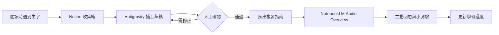
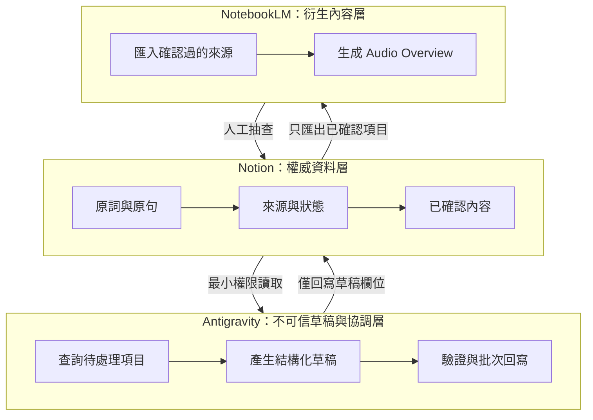

<!-- SIMPLE -->

如果你把英文單字記進 Notion，卻很少回頭複習，問題通常不是「不夠努力」，而是記錄、整理與複習分散在不同地方。我把它們串成一條工作流：**Notion 負責收集，Antigravity 負責整理，NotebookLM 負責把內容轉成可以用聽的複習材料。**

> **一句話版本**：看到生字先丟進 Notion；讓 AI 補上例句與搭配詞；人工確認後匯入 NotebookLM，生成 Audio Overview，最後再用小測驗確認自己真的記得。

## 三個工具各自負責什麼？

| 工具 | 在流程中的角色 | 不建議交給它的事 |
|---|---|---|
| **Notion** | 保存單字、例句、來源與學習進度 | 自動判斷內容一定正確 |
| **Antigravity** | 找出待整理單字、產生草稿、回寫欄位與匯出複習稿 | 未經確認就大量覆蓋筆記 |
| **NotebookLM** | 依上傳來源生成 Audio Overview 等複習材料 | 取代字典、教師或主動測驗 |



## 開始前，只要準備五個欄位

| 欄位 | 範例 | 用途 |
|---|---|---|
| 單字／片語 | `in compliance with` | 要學習的內容 |
| 中文意思 | 符合、遵照 | 經人工確認的核心釋義 |
| 例句與搭配詞 | comply with regulations | 放進真實語境理解 |
| 來源 | 論文、郵件或題目連結 | 回頭確認原始用法 |
| 狀態 | 待補充／待確認／複習中／已掌握 | 告訴系統下一步要做什麼 |

「來源」很重要。相同單字在論文、商務郵件與多益題目裡可能有不同用法；留下原句，之後才知道 AI 的解釋是否符合當時情境。

<figure class="article-figure">
  
  <figcaption>實際的 Notion 單字庫畫廊：每張卡片可快速比較字義、搭配詞、例句與學習狀態。公開版已遮蔽帳號及私人側欄。</figcaption>
</figure>

## 實作流程

### 1. 先快速收集，不要中斷閱讀

閱讀時只記下單字、原句與來源，狀態設為「待補充」。不要為了把卡片做漂亮而中斷正在讀的內容。

**成功長這樣：** 即使其他欄位仍空白，你已經能從來源找回這個詞出現的完整情境。

### 2. 讓 Antigravity 產生「待確認草稿」

代理人可以補上詞性、繁體中文核心釋義、短例句、常見搭配詞、介系詞，以及容易混淆的詞。適合圖像化時，再加上一個簡單的記憶意象。

例如 `liable` 不只要寫「負有責任的」，還要區分 `be liable for + 名詞` 與 `be liable to + 原形動詞`。不過，AI 產出的內容應先標成「待確認」，不能直接當成標準答案。

**成功長這樣：** 原本只有一個詞的卡片，已經有可追溯來源、例句及搭配詞，而且既有人工內容沒有被覆蓋。

<figure class="article-figure">
  
  <figcaption>單字卡總覽：資料庫欄位先保留核心資訊，避免讀者一打開就被過多內容淹沒。</figcaption>
</figure>

<figure class="article-figure">
  
  <figcaption>同一張卡片的補充區塊：AI 草稿把例句、collocations 與同義詞整理成容易人工查核的結構。</figcaption>
</figure>

### 3. 人工確認後，再建立複習指南

確認字義、例句與搭配詞後，把狀態改成「複習中」。Antigravity 再把這批單字輸出成結構固定的 Markdown：每個詞只保留發音提示、核心意思、搭配詞、原句與一個自我測驗問題。

**成功長這樣：** 只要閱讀這份 Markdown，不開 Notion 也能完整複習；每一筆內容都能追溯到原始來源。

### 4. 上傳 NotebookLM，生成 Audio Overview

把確認過的複習指南加入 NotebookLM，在 Studio 中選擇 Audio Overview，指定繁體中文以及希望聚焦的內容，例如：「請比較容易混淆的搭配詞，先留幾秒讓聽者回答，再說明正確用法。」

NotebookLM 的音訊是 AI 生成內容，仍可能不準確或出現音訊錯誤。因此，重要字義仍要回到原始來源或可信字典核對。

**成功長這樣：** 音訊確實使用這批單字、能指出常見混淆點，而且沒有加入來源中不存在的新規則。

<figure class="article-figure">
  
  <figcaption>NotebookLM 成品：左側是經確認後匯入的單字指南，右側已產生 Audio Overview。公開版已遮蔽個人頭像。</figcaption>
</figure>

### 5. 聽完後一定要「想答案」

Podcast 適合增加接觸次數，也方便在通勤或運動時複習，但被動聆聽不等於記住。比較好的做法是：

1. 聽到單字後先暫停，自己說出意思或搭配詞；
2. 回到 Notion 做一個簡短測驗；
3. 答錯就保留在「複習中」，連續答對後再改成「已掌握」；
4. 一段時間後再次抽查，而不是只看一次。

## 最容易忽略的三件事

1. **不要把密鑰寫進筆記或程式碼。** Notion token 應放在環境變數或安全的憑證管理工具中。
2. **不要讓 AI 無條件覆蓋資料。** 只補空欄位或另存草稿，並保留最後修改時間。
3. **不要上傳敏感內容。** 工作郵件、未公開研究資料與個資要先去識別化，再決定是否送往外部服務。

## 總結

這套工作流真正節省的不是「背單字的時間」，而是整理資料的重複工作。Notion 保存可追溯的學習紀錄，Antigravity 處理格式化與搬運，NotebookLM 增加一種聽覺複習方式；最後是否學會，仍取決於人工查核、主動回想與重複測驗。

### 官方說明

- [Notion API Authentication](https://developers.notion.com/reference/authentication)
- [NotebookLM：建立 Audio Overview](https://support.google.com/notebooklm/answer/16212820?hl=zh-Hant)
- [NotebookLM：加入與管理來源](https://support.google.com/notebooklm/answer/16215270?hl=zh-Hant)

<!-- PROFESSIONAL -->

# 從單字資料庫到 Audio Overview：可稽核的 Notion × Antigravity × NotebookLM 工作流

> **系統定位**：Notion 是單一資料來源（system of record），Antigravity 是工作流協調與內容草稿層，NotebookLM 是限定來源的衍生內容層。任何 AI 產出都必須經驗證，且不得直接覆蓋已確認資料。

## 1. 設計目標

這套系統要解決的不是單純「自動產生單字卡」，而是四個可操作的問題：降低收集成本、保留來源追溯、將重複格式轉換交給代理人，以及把確認過的內容轉成音訊，同時保留人工品質控制與學習成效測量。

## 2. 系統架構與信任邊界



代理人可以寫入草稿欄位，但只有使用者能把狀態改成 `verified`。NotebookLM 只接收已確認的匯出版本，避免錯誤經過多個生成步驟後被放大。

<figure class="article-figure">
  
  <figcaption>Notion 作為 system of record 的實際介面。畫廊適合快速巡覽；正式處理仍應依結構化屬性與狀態查詢，不依賴畫面文字。</figcaption>
</figure>

## 3. 建議的資料模型

| 欄位 | 型別 | 說明 |
|---|---|---|
| `term` | title | 單字或片語 |
| `source_sentence` | rich text | 原始句子，不由 AI 改寫 |
| `source_url` | URL | 來源；敏感資料可用內部識別碼 |
| `context` | select | academic／business／TOEIC／general |
| `draft_meaning` | rich text | AI 草稿，不視為已確認內容 |
| `verified_meaning` | rich text | 人工確認後的核心釋義 |
| `collocations` | rich text | 固定搭配、介系詞與詞性變化 |
| `status` | status | captured／enriched／needs_review／verified／reviewing／mastered |
| `review_due` | date | 下一次主動回想日期 |
| `source_hash` | rich text | 判斷輸入是否改變，避免重複處理 |
| `agent_updated_at` | date | 代理人最後更新時間，便於稽核 |

若流程仍在試驗階段，`term + source_sentence` 可作為暫時去重鍵；正式批次流程則建議使用 page ID 與內容雜湊，避免同字異義被錯誤合併。

## 4. 狀態機與冪等更新

```text
captured → enriched → needs_review → verified → reviewing → mastered
                    ↘ rejected
```

每次執行應符合冪等性（idempotency）：相同輸入重跑不建立重複頁面，也不改寫人工確認欄位。建議只查詢待處理項目、將 AI 結果寫入 `draft_*`、更新前檢查 `last_edited_time`，並保存成功、跳過、失敗與重試紀錄。單筆失敗不應中止整批，也不能留下半完成狀態。

## 5. 內容產生契約

不要要求代理人直接產生自由格式長文。先定義結構化輸出，驗證後再轉成 Notion 欄位：

```json
{
  "term": "compliance",
  "part_of_speech": ["noun"],
  "meaning_zh_tw": "遵守；符合",
  "collocations": ["in compliance with", "regulatory compliance"],
  "example": "The procedure is in compliance with the regulations.",
  "review_question": "compliance 最常與哪個介系詞搭配？",
  "needs_human_review": true
}
```

回寫前至少檢查必要鍵、欄位型別、字串長度、例句是否包含目標詞，以及輸出是否與原始語境衝突。若需要精確發音、詞源或考試頻率，還應串接有授權且可追溯的字典或題庫，而不是只依賴生成模型。

<figure class="article-figure">
  
  <figcaption>屬性層保存可查詢資料；正文區則承載較長的教學內容。兩者分開可避免 API 批次處理與人工閱讀互相干擾。</figcaption>
</figure>

<figure class="article-figure">
  
  <figcaption>結構化草稿的實際呈現。這些內容仍需通過來源、語境與字典查核，才能由 draft 狀態轉為 verified。</figcaption>
</figure>

## 6. Notion API 實作注意事項

Notion API 以 bearer token 驗證。token 應放在環境變數或秘密管理服務，禁止硬編碼或提交到 GitHub。Connection 只分享至必要頁面，並遵循最小權限原則。

Notion API 使用日期式版本標頭；實作時應依[官方版本文件](https://developers.notion.com/reference/versioning)選擇與 SDK 相容的版本，並在升級前用測試資料庫驗證 schema 與回寫行為，不把可能過期的版本號永久寫死在教學文章中。

## 7. 匯出與 NotebookLM 整合

匯出器只選取 `verified` 或 `reviewing` 項目。每個詞固定包含來源語境、人工確認釋義、搭配詞、例句、混淆詞與一道主動回想題。

NotebookLM 可以依匯入來源建立 Audio Overview，並設定語言、長度與聚焦提示；但官方提醒，AI 音訊仍可能不準確或出現音訊錯誤。生成後應抽查是否混淆詞性、虛構規則、使用來源外資訊，或暴露不應出現在音訊中的內容。

若透過 CLI、MCP 或瀏覽器自動化操作 NotebookLM，應把它視為可替換的 adapter。工具介面改變時，只調整整合層，不影響 Notion schema 與已確認資料。

<figure class="article-figure">
  
  <figcaption>NotebookLM 整合層的實際成品：來源、對話與 Audio Overview 位於同一筆記本。截圖只表示生成成功，不代表內容已通過正確性驗證。</figcaption>
</figure>

## 8. 隱私與安全

1. Notion token、Notebook 識別碼與存取憑證不得出現在提示詞、日誌或公開 repo。
2. 工作郵件、學生資料或未公開研究內容應先去識別化；必要時完全不要送往第三方服務。
3. 日誌只記錄 page ID、狀態與錯誤類型，不記完整敏感句子。
4. 測試與正式資料庫分離；批次回寫先使用少量測試頁面。
5. 為人工確認欄位保留修改歷史與回復方式。

## 9. 如何評估工作流是否真的有效？

| 層級 | 指標範例 | 要回答的問題 |
|---|---|---|
| 系統 | 每筆處理時間、失敗率、重複率、人工修正率 | 自動化是否可靠？ |
| 內容 | 錯誤字義率、無來源陳述率、搭配詞通過率 | 產出是否可信？ |
| 學習 | 延遲回想正確率、保留率、到期項目完成率 | 使用者是否真的記得？ |

最簡單的個人測試可以比較兩組單字：一組只閱讀文字卡，另一組加上 Audio Overview，但兩組使用相同的主動回想排程；一週後比較正確率。這比單憑新鮮感判斷更有意義。

## 10. 方法限制與延伸

Audio Overview 是複習介面，不是間隔重複系統；Notion 是資料庫，也不會自動形成有效測驗。完整閉環仍需加入到期排程、作答紀錄與依表現調整的複習規則。

後續可以延伸為：從論文擷取術語但保留 DOI 與原句；依錯誤類型建立不同複習批次；將作答結果回寫 Notion 並計算下次複習日期；以及為不同來源建立獨立資料權限與匯出規則。

## 官方文件

- [Notion API：Authentication](https://developers.notion.com/reference/authentication)
- [Notion API：Versioning](https://developers.notion.com/reference/versioning)
- [NotebookLM：Generate Audio Overview](https://support.google.com/notebooklm/answer/16212820)
- [NotebookLM：Add or discover new sources](https://support.google.com/notebooklm/answer/16215270)

> **版本與證據說明（2026-08-25）**：本文描述的是可重用的工作流設計，不保證特定第三方 CLI 或 MCP 指令永久相容。實際串接前請以官方文件與目前安裝版本為準。
